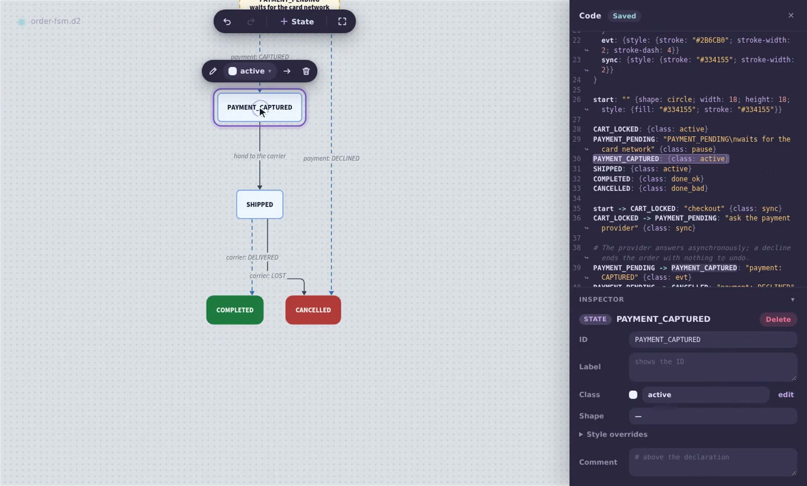

#  d2-live

[](https://github.com/pltanton/d2-live/tags)
[](go.mod)

**A live preview for [D2](https://d2lang.com) diagrams that you can also edit.**

Keep a diagram open next to your editor: it redraws whenever the `.d2` file
changes, whoever wrote it. Press `E` and the picture becomes editable — click a
state, rename it, wire a transition — and the file changes by exactly those
lines. See it in action at [d2-live.pltanton.dev](https://d2-live.pltanton.dev).



- **Live preview** that follows the file, from any editor, script or agent.
- **One server for every diagram**: open a file or a directory, switch between
  them in the tab.
- **Layouts and sketch mode** switched in place; pan and zoom that survive
  redraws.
- **Copy or download** PNG and SVG.
- **Edit mode** for diagrams of shapes and arrows (state machines,
  flowcharts), with the code alongside and diffs only where you changed something.
- **Opens from your editor** over LSP, and ships a skill for coding agents.

## Install

With Nix:

```bash
nix profile install github:pltanton/d2-live   # update: nix profile upgrade d2-live · remove: nix profile remove d2-live
```

On NixOS or home-manager, add the flake as an input and the package to your packages:

```nix
inputs.d2-live.url = "github:pltanton/d2-live";
# …
environment.systemPackages = [ inputs.d2-live.packages.${pkgs.stdenv.hostPlatform.system}.default ];
```

Anywhere else, with Go 1.25 or newer:

```bash
go install github.com/pltanton/d2-live@latest   # the same command updates it
rm "$(go env GOPATH)/bin/d2-live"               # removes it
```

Rendering, editing and PNG export happen inside d2-live. The `d2` CLI is only
used for the `tala` layout engine and for PNGs of diagrams with markdown labels
(the browser will not export those); install it from
[d2lang.com](https://d2lang.com/tour/install) if you need either.

## Use

```bash
d2-live diagram.d2      # one file
d2-live ./diagrams      # every *.d2 under a directory
```

The first call starts the preview server and opens a tab; later calls add
files to the same server and return at once. The server exits on `Ctrl-C`, or
after `--idle-timeout` with no tab open.

| Flag | |
|---|---|
| `--layout elk\|dagre\|tala` | layout engine to start with (switchable in the tab) |
| `--sketch` | start in sketch mode |
| `--port PORT` | bind to a port (`0` picks one) |
| `--browser CMD` / `--no-browser` | which browser to open, or none |
| `--idle-timeout DUR` | exit after this long without tabs (default `10m`, `0` never) |
| `--close PATH` | take a file or directory out of the running server |
| `--lsp` | run as a language server (see below) |

Deleting a diagram removes it from the server too.

## Edit mode

Press `E` in a tab. A code panel opens next to the diagram.

- **Click** a shape or an arrow to select it; its declaration lights up in the
  code. Putting the cursor on a line selects what it declares.
- **The toolbar over the selection** changes its class, connects it to another
  shape (or to empty canvas for a new one), reverses or deletes it.
- **The inspector** below the code edits the ID (references follow), label
  (markdown stays markdown), class, shape, style overrides and the `#` comment
  above the declaration.
- **Typing** in the code panel previews without saving; `⌘S` writes the file.
  Changes made by clicking are written at once and can be undone.
- **Edits from elsewhere** stream in; if one races your unsaved typing, you
  choose which to keep.

Keys: `N` new shape, `C` connect, `⌫` delete, `Enter` rename, `F` fit, `⌘Z` /
`⇧⌘Z` undo/redo, `⌘S` save, `Esc` deselect, `E` leave.

Clicking edits top-level shapes and single `a -> b` arrows. Containers, chains
like `a -> b -> c`, sequence diagrams, layers and imports preview live and are
edited in the code panel.

## Editor integration

`d2-live --lsp` speaks just enough of the Language Server Protocol over stdio to
launch a live preview from your editor — no keybindings or custom commands.
Attach it as a language server for `.d2` files: when you open one, d2-live
registers it with the preview server and opens a browser tab. Saving the buffer
refreshes the preview (via the file watcher). When the editor exits, it shuts
the language server down, which takes the preview server with it — so nothing is
left orphaned.

### Helix

In `~/.config/helix/languages.toml`:

```toml
[language-server.d2-live]
command = "d2-live"
args = ["--lsp"]

[[language]]
name = "d2"
file-types = ["d2"]
language-servers = ["d2-live"]
```

`d2-live` must be on Helix's `PATH` (use an absolute `command` otherwise). Open
any `.d2` file and the preview appears automatically.

## Agent plugin

The repository is a Claude Code plugin marketplace with a `d2-live` skill: the
agent registers the diagrams it writes with your running server, gives you the
preview link instead of restarting the server, checks the diagram compiles, and
re-reads the file before editing it — you may be editing it in the tab.

```
/plugin marketplace add pltanton/d2-live
/plugin install d2-live@d2-live
```

Its helper, `skills/d2-live/scripts/d2-live-preview`, works on its own: it
reuses a running server or starts a detached one and prints the preview URL
without blocking.

## Development

```bash
go test ./...                                    # unit tests
go build -o d2-live . && ./scripts/itest.py ./d2-live   # end-to-end: LSP stdio, CLI, watcher, prune, edit endpoints
go test -run TestOps -update                     # regenerate testdata/golden after an intended change to an edit op
```

The code panel uses a prebuilt CodeMirror bundle, `ui/vendor/codemirror.js`.
To rebuild it: `cd scripts/codemirror && npm ci && npm run build`.

The end-to-end script drives a real binary in an isolated `XDG_RUNTIME_DIR`, so
it never touches a server you have running.

Server discovery uses a lock file under `$XDG_RUNTIME_DIR/d2-live/` (falling
back to `$XDG_CACHE_HOME` or a temp dir); concurrent first launches resolve to
one server through an exclusive `flock`. The lock lives in a package-level
variable on purpose: `os.File`'s finalizer closes the fd and so releases the
`flock`, which used to let a second server start next to a healthy one.
